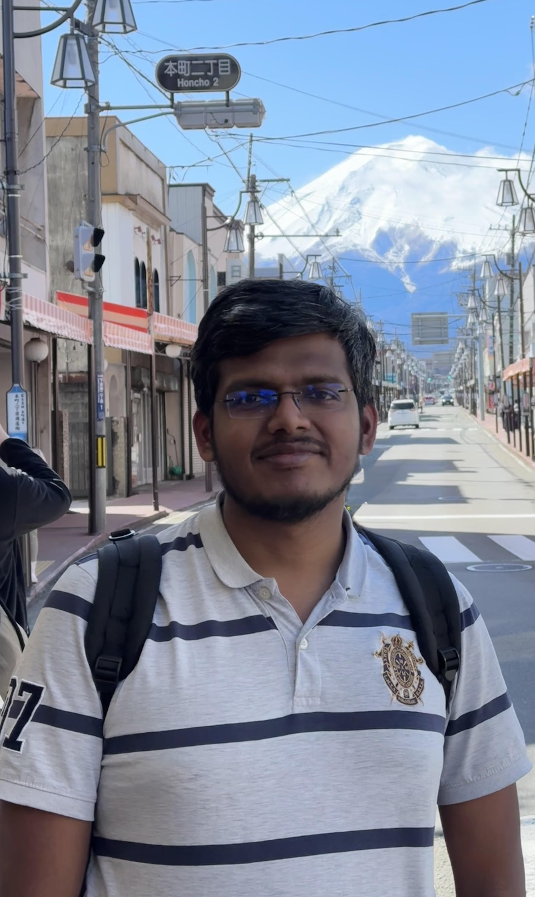

:::{.column-body-outset}

::: {layout="[[40, 60]]"}

  {width="70%" height="70%"}

  
&nbsp;

  

    I am a second-year PhD student in the Department of Computer Science at North Carolina State University. I am fortunate to work with <a href="https://www.csc.ncsu.edu/people/svalliy" target="_blank">Dr. Sharma Thankachan</a>.
  

   

  

    My research interests lie broadly in the field of Algorithms, with a particular focus on String and Graph algorithms. These areas fascinate me due to their fundamental importance in computer science and their wide-ranging applications in various disciplines.
  

   

  

    You can reach out to me via mpartha [at] ncsu [dot] edu . Please feel free to reach out! 
  

:::
:::
